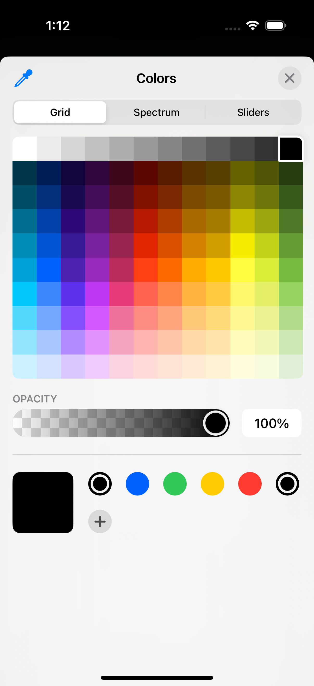
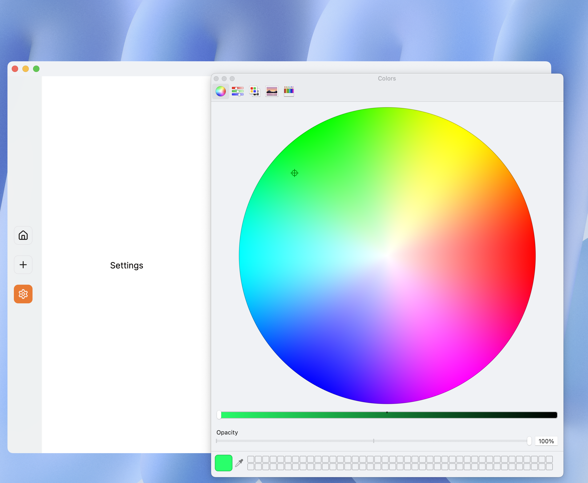

# Native iOS Color Picker

A Flutter plugin that provides a native iOS color picker interface using the UIColorPickerViewController available in iOS 14 and above.

## Features

- Native iOS color picker UI
- Returns RGBA color values
- Supports iOS 14+ devices
- Simple and easy-to-use API

## Requirements

- iOS 14.0 or higher
- Flutter 2.0.0 or higher

## Installation

Add this to your package's `pubspec.yaml` file:

```yaml
dependencies:
  native_ios_color_picker: ^0.0.1
```

Then run:

```bash
$ flutter pub get
```

## Usage

First, import the package:

```dart
import 'package:native_ios_color_picker/native_ios_color_picker.dart';
```

Then, you can show the color picker using the static method `showColorPicker()`:

```dart
try {
  final colorValues = await NativeIosColorPicker.showColorPicker();
  print('Selected color: $colorValues');
  // colorValues contains:
  // {
  //   'red': 0.5,    // value between 0.0 and 1.0
  //   'green': 0.3,   // value between 0.0 and 1.0
  //   'blue': 0.7,    // value between 0.0 and 1.0
  //   'alpha': 1.0    // value between 0.0 and 1.0
  // }
} catch (e) {
  print('Error showing color picker: $e');
}
```

### Screenshots

#### iOS Color Picker


#### macOS Color Picker


### Using with ColorModel

The package also provides a `ColorModel` class for easier color handling:

```dart
// Create from color picker result
final colorValues = await NativeIosColorPicker.showColorPicker();
final colorModel = ColorModel.fromMap(colorValues);

// Convert to Flutter Color
final flutterColor = colorModel.toColor();

// Access individual components
print('Red: ${colorModel.red}');
print('Green: ${colorModel.green}');
print('Blue: ${colorModel.blue}');
print('Alpha: ${colorModel.alpha}');
```

## API Reference

### NativeIosColorPicker

#### `static Future<Map<String, double>> showColorPicker()`

Shows the native iOS color picker and returns the selected color values as a map containing RGBA components (values between 0.0 and 1.0).

### ColorModel

#### `ColorModel({required double red, required double green, required double blue, required double alpha})`

Creates a new ColorModel instance with the specified RGBA values (between 0.0 and 1.0).

#### `ColorModel.fromMap(Map<String, double> map)`

Creates a ColorModel instance from a map containing RGBA values.

#### `Color toColor()`

Converts the ColorModel to a Flutter Color object.

#### `Map<String, double> toMap()`

Converts the ColorModel to a map containing RGBA values.

## Platform Support

| Platform | Support |
|----------|----------|
| iOS      | iOS 14+  |
| macOS    | 10.15+   |
| Android  | ❌       |
| Web      | ❌       |
| Windows  | ❌       |
| Linux    | ❌       |

## Contributing

Contributions are welcome! If you find a bug or want to add a feature, please feel free to create an issue or submit a pull request.

## License

This project is licensed under the MIT License - see the [LICENSE](LICENSE) file for details.